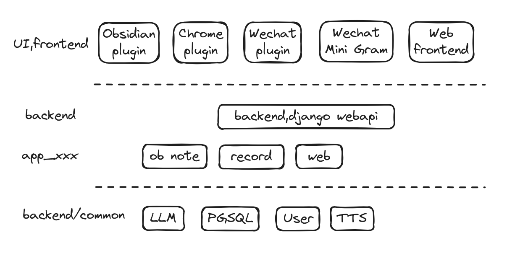

English | [中文简体](./README_cn.md)

# ExMemo

> Total Control Over My Data 🚀

## 1 Introduction


ExMemo is a personal knowledge management project designed to centrally record and manage various information, including favorite texts, books, music, videos, web pages, work documents, as well as thoughts and reflections on life. Even specific information like item locations, phone numbers, and addresses can be automatically categorized and found whenever needed. By systematically integrating data, it breaks the limitations of thinking and discovers internal connections.



The system consists of a database, backend, and multiple frontends. Distributed storage and databases are used to store user files, texts, and corresponding vector data. Data storage can be deployed locally to protect user privacy. The backend provides general interfaces for adding, deleting, modifying, and querying data, and is responsible for invoking large models and processing data. The system supports online large models such as OpenAI, Gemini, Qwen, as well as the offline Ollama model. Multiple frontends, including web services, WeChat bots, Obsidian plugins, and browser extensions, allow users to upload and download data.

Additionally, I have added some small tools on top of the data framework, such as calorie calculators, translation, and paper reading assistance. These tools demonstrate the effect of combining personal data with large models and tools. Other developers can also develop their own data-based applications using the backend service.

## 2 Installation and Operation

The system uses modular management. It is implemented using PgVector database, Python, JavaScript + VUE3, and TypeScript. Due to different environments, the system is split into multiple Docker images. Users only need to edit the docker-compose.yml file to start the required modules.

### 2.1 Environment

Download the source code. Assume all project-related data will be stored in the /exports/exmemo directory.

```shell
$ mkdir -p /exports/exmemo
$ cd /exports/exmemo
$ mkdir code
$ mkdir data
$ cd code
$ git clone https://github.com/exmemo-ai/exmemo.git
$ git clone https://github.com/zhayujie/chatgpt-on-wechat # if use wechat, download it
$ cd exmemo
```

Configure the user's personal environment variables according to the env_default format.

```shell
$ cp backend/env_default backend/.env
$ vi backend/.env
```

* At least the following parameters need to be set: IP address, LANGUAGE_CODE, and PGSQL_PASSWORD.
* It is recommended to use OpenAI as the backend model:
    * If you can connect to OpenAI, set the OPENAI_API_KEY.
    * If you cannot connect to OpenAI, for example in China, you can set DEFAULT_CHAT_* and DEFAULT_TOOL_* to deepseek and configure the DEEPSEEK section.

### 2.2 Configure Plugin

#### 2.2.1 WeChat Plugin
(Optional)

```shell
$ cd ui/wechat/
$ . install.sh # Copy plugin to WeChat tool
$ cd ../../
```

#### 2.2.2 Obsidian Plugin
(Optional)

Compile the Obsidian plugin as needed and install it in Obsidian. For details, see:
https://github.com/exmemo-ai/obsidian-exmemo-client

### 2.3 Start Services

#### 2.3.1 Start in Production Mode

```shell
$ docker-compose --env-file backend/.env --profile production up -d
```

At this point, open http://ip:8084/ to see the frontend interface. Please register a user before using it.

#### 2.3.2 Start in Development Mode
(Optional)

If you need to debug the frontend and backend code, start in development mode.

```shell
$ docker-compose --env-file backend/.env --profile development up -d
```

#### 2.3.3 S3 Storage: Minio
(Optional)

By default, data is stored in the host machine's directory. If you want to use Minio S3 storage, configure the relevant MINIO items in the .env file. Minio Docker does not start by default. If you want to start the Minio service on the host, do so manually.

```shell
$ docker-compose -f docker-compose-dev.yml up -d minio
```

#### 2.3.4 WeChat Login
(Optional)

If you don't use WeChat, you can skip this step. This is for connecting ExMemo services as a plugin to the chatgpt-on-wechat. For details, see the project: https://github.com/zhayujie/chatgpt-on-wechat

```shell
docker logs kwechat
```

Scan the QR code in the logs to log in.

Usage: User A (bot) logs in by scanning the code. Other users can chat with the large model and read/write/search user data through conversations with A (bot). If you are using it for the first time, type "help" to see all the features.

Debugging: When running the program, check if the ExMemo plugin is loaded and initialized correctly. If it fails to initialize, check whether ExMemo is set to true in the chatgpt-on-wechat/plugins/plugins.json file.

### 2.4 Upgrade

After upgrading, rebuild the Docker image and rerun Docker Compose. Remove old containers during restart to avoid unexpected issues. Refer to shell/update.sh for details.

*Please upgrade the following simultaneously: Frontend, Backend, Plugins, and the .env file to avoid feature issues from API changes.*

### 2.5 Notes

Packaging can consume a lot of memory. If cloud server resources are limited, it is recommended to free up some resources.

The database password set in Docker Compose takes effect only when the database is created. If you need to change the password later, you will need to update it not only in the .env file but also by connecting to the database and using SQL commands to change it.

## 3 Changelog

View the complete update history: [CHANGELOG](./CHANGELOG.md)

## 4 License

This project is licensed under the terms of the GNU Lesser General Public License v3.0. See the [LICENSE](./LICENSE) file for details.

## 5 Contributors

<a href="https://github.com/Exmemo/exmemo/graphs/contributors" target="_blank">
  
</a>
